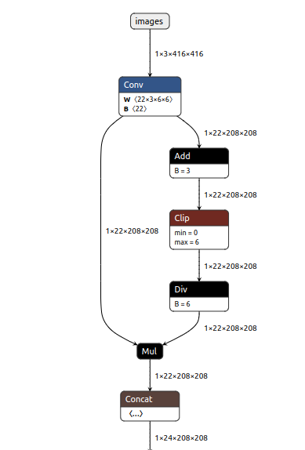
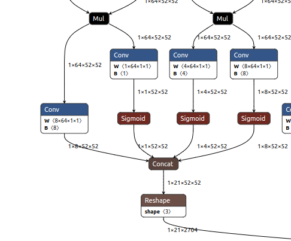
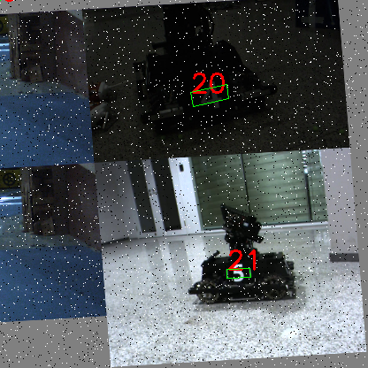

# Copyright(C),2018-2022,沈阳航空航天大学T-UP战队 All Rights Reserved
# Autoaim Module
## Author: 顾昊 guhao0521@gmail.com
# 1. 简介
Autoaim模块是自瞄任务模块，负责处理自瞄有关的神经网络推理，装甲板识别与击打目标选择任务。
# 2.文件结构
├── detector   
│   ├── inference.cpp   //推理cpp文件   
│   └── inference.h     //推理头文件   
└── predictor    
│   ├── predictor.cpp   //预测器cpp文件   
│   └── predictor.h     //预测器头文件   
├── armor_tracker.cpp   //装甲板trackercpp文件   
├── armor_tracker.h     //装甲板tracker头文件   
├── autoaim.cpp         //自瞄cpp文件   
├── autoaim.h           //自瞄头文件   
├── CMakeLists.txt      //模块Cmake文件（已弃用）   
└── README.md           //文档
# 3.流程图   

# 4.部分技术细节详解
## 1.反陀螺
### 1.陀螺状态识别
陀螺识别部分实现原理较为简单。我们可以陀螺识别模块看作一个系统，这样就可以将该部分的功能分解为两个部分来看，即激励与响应。
#### 1. 激励
激励部分未作过多处理，当存在新增追踪器时，便触发陀螺状态检测，若同时存在两个追踪器，且一个为新增，一个先前存在，且两个追踪器本次都有更新，便视作该车辆进行了一次陀螺动作，进行激励。
#### 2. 系统
该系统可视作由两个函数构成，一个为增益函数，一个为衰减函数。
增益函数分三段，分别对应初值为0的情况，初值与目前值相反的情况、初值与目前值同号的情况。  
衰减函数假设整个陀螺状态为一阶马尔可夫过程，只取决于上一个状态,分两段，分别对应陀螺状态已确定与陀螺状态未确定。
### 2.击打目标选择
击打目标原计划采用是根据装甲板中心多帧位置与旋转矩阵和与陀螺陀螺解算陀螺旋转中心与半径并瞄准旋转轨迹圆心上最近的一点，在角度阈值达到一定范围内开火。但这样的方法很难对旋转和平移复合运动的陀螺进行准确击打，因此并未采用。   
目前采用的是瞄准旋转方向上落后的一块装甲板。
### 3.不足与展望
[1] 本人着手写反陀螺部分时，并未学习信号与系统这门，并没有意识到该模块可以当作一个系统看待，因此该函数的设计与参数给定十分粗糙，下一赛季会对该方面着手进行改进。  
[2] 陀螺目标信号因为装甲板置信度变化较大，会出现装甲板时有时无的状况。这样会引入高频噪声，造成陀螺的误识别，可以考虑进行滤波处理，对过分高频的信号进行滤除。  
[3] 预测部分可以考虑通过旋转矩阵进行速度继承，加快预测器收敛。

## 2.神经网络目标检测
### 1.简述
神经网络目标检测部分我们基于YOLOX-Nano进行修改，并对网络进行了一些改进，以提高网络推理的速度和精度，让网络符合使用实际需求。  

- 将网络头部的Focus层更换为6*6卷积，优化推理速度。
- 增加CoordConv，为网络输入增加xy坐标特征图，提升回归精度。
  
- 替换网络backbone为shufflenetV2,加快推理速度。
- 将检测头reg分支由xywh改为x1y1x2y2x3y3x4y4,形式上类似关键点检测，并使用WingLoss训练。  
- 为检测头增加color分支，将分类数由类别*颜色变为类别+颜色。有效降低分类维度，提高各类样本数，降低网络学习难度。  
  
### 2.训练技巧分享
#### 1.数据增强
椒盐噪声作为一种常见的噪声类型，在图像中经常出现。同时为图像中添加椒盐噪声，也能模拟装甲板贴纸出现小幅度破损的情况。因此，在Mosaic数据增强与HSV数据增强外，我们尝试了为图像中随机增添椒盐噪声进行数据增强的方法。  
  
在添加椒盐噪声后，网络分类准确率有了一定的上升，说明添加椒盐噪声的数据增强方法对提高网络分类准确率有一定的帮助。

# 5.参考文献
[1]Harry-hhj et al. (2021) 上海交通大学 RoboMaster 战队 2021 赛季视觉代码框架[SourceCode].  
https://github.com/Harry-hhj/CVRM2021-sjtu  
[2]Megvii (2021) YOLOX[SourceCode].  
https://github.com/Megvii-BaseDetection/YOLOX  
[3]Ningning Ma, Xiangyu Zhang, Hai-Tao Zheng, Jian Sun. ShuffleNet V2: Practical Guidelines for Efficient CNN Architecture Design[C].Salty Lake:Proceedings of the European Conference on Computer Vision (ECCV),2018  
[4]Rosanne Liu, Joel Lehman, Piero Molino, Felipe Petroski Such, Eric Frank, Alex Sergeev, Jason Yosinski. An Intriguing Failing of Convolutional Neural Networks and the CoordConv Solution[C].Montreal:Conference on Neural Information Processing Systems(NeurIPS),2018  
